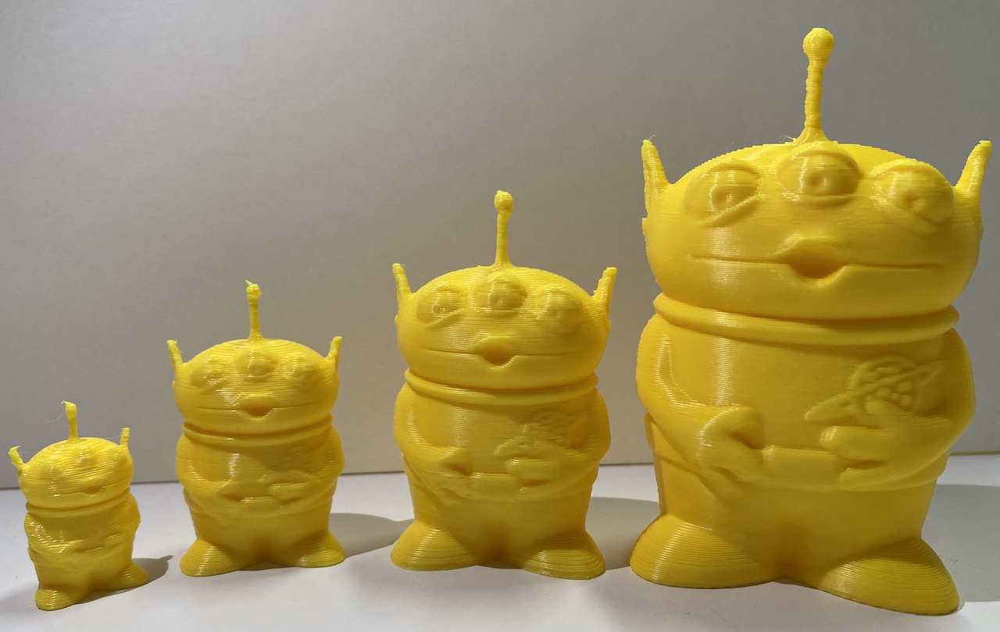

<h1 align="center">
  3D-Printer Anomaly Detection
</h1>

<p align="center">
  <a href="https://www.kaggle.com/datasets/justin900429/3d-printer-defected-dataset"></a>
<p>

## Introduction

This project is to design a system for detecting the anomalies during the printing process. We collect our own dataset with a RPI and a Ender 3 pro. This project mainly consists three components - RPI, User application, and Linebot. Users can setup these three components to start using our projects.

## Installation
```bash
# Download the weights
$ wget -O weights/resnet.onnx https://github.com/Justin900429/3d-printer-anomaly-detect/releases/download/v0.0.1-alpha/resnet.onnx
$ wget -O weights/resnet.pt https://github.com/Justin900429/3d-printer-anomaly-detect/releases/download/v0.0.1-alpha/resnet.pt
$ wget -O weights/resnet.pt https://github.com/Justin900429/3d-printer-anomaly-detect/releases/download/v0.0.1-alpha/quantized.pt


# Install the python package
$ pip install -r requirements.txt
```

## Run file
### RPI

> Before using our project, users should install [OctoPrint](https://octoprint.org/download/) first

```bash
$ pip install opencv-python
$ python send_image.py
```

### Backend
```bash
$ python backend/main.py
```

### Linebot

> We use [ngrok](https://ngrok.com) to host our linebot server, users can use [Heroku](https://www.heroku.com
> ) as well

```bash
$ export FLASK_APP=app.py
$ flask run
```

## Dataset

We upload our data to [kaggle](https://www.kaggle.com/datasets/justin900429/3d-printer-defected-dataset).

## Model

### Performance

| Training method             | Acc  | UF1  | Model size |
| --------------------------- | ---- | ---- | ---------- |
| Meta Learning               | 100% | 1.0  | 85.3 MB    |
| Quantization aware training | 100% | 1.0  | 21.5 MB    |

### Inference Speed

> We test the inference speed with CPU on MacBook Pro 2020 by averaging the 10 samples' runtime

| Model                  | Avg. inference time |
| ---------------------- | ------------------- |
| PyTorch                | 0.2544 s            |
| ONNX                   | 0.0382 s            |
| Quantization (PyTorch) | 0.0356 s            |

### Notebook

| Usage         | Link                                                         |
| ------------- | ------------------------------------------------------------ |
| Meta Learning | [](https://colab.research.google.com/github/Justin900429/3d-printer-anomaly-detect/blob/main/Meta_3D_printer.ipynb) |
| Quantization  | [](https://colab.research.google.com/github/Justin900429/3d-printer-anomaly-detect/blob/main/quantize.ipynb) |

